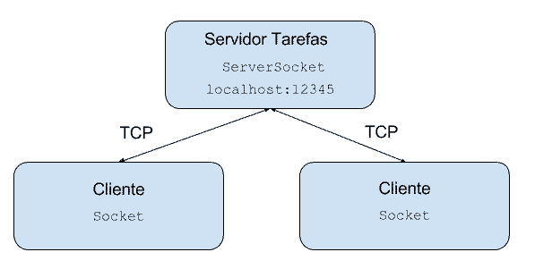

# Socket Test

A simple project with Socket and Threads to learn new employees of company.
I try demonstrate the use of protocol TCP to transportation.



## Pré requisito
- Maven 3
- Java 11

## Preparando ambiente

Server
- ```cd server```
- ```mvn clean install```

Client
- ```cd client```
- ```mvn clean install```

## Executando 

Server
- ```cd server```
- ```mvn exec:java```

Client
- ```cd client```
- ```mvn exec:java```


You can start how many clients you would like to start.

